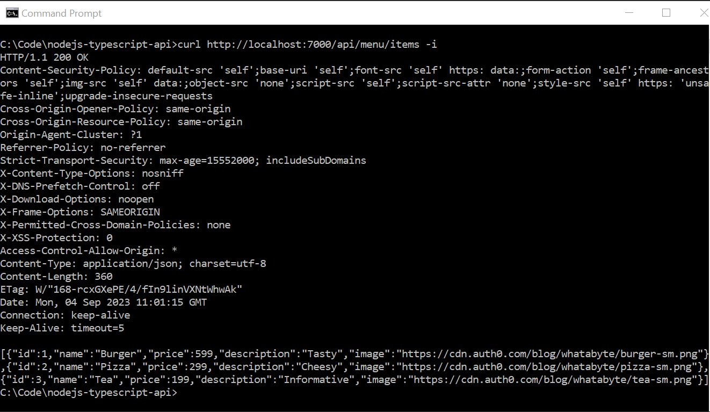
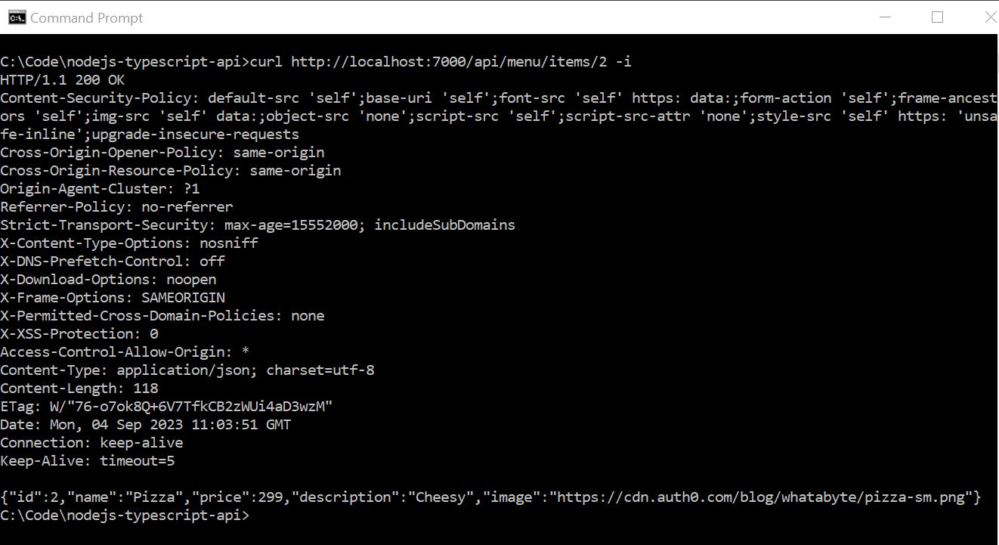
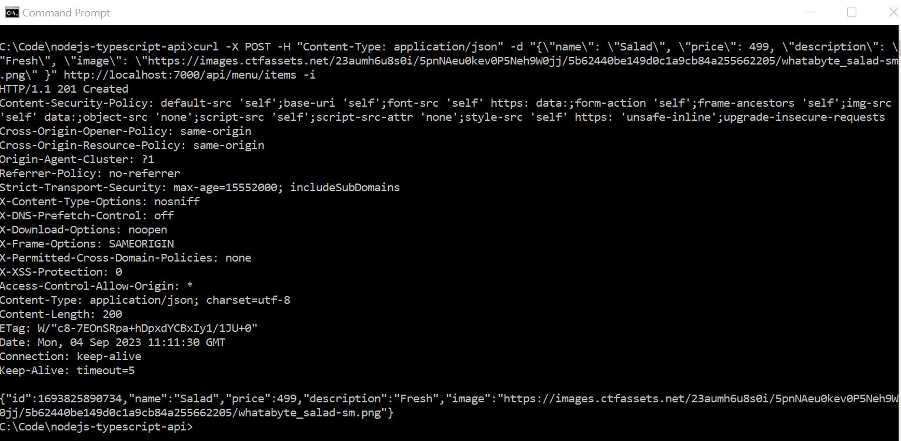
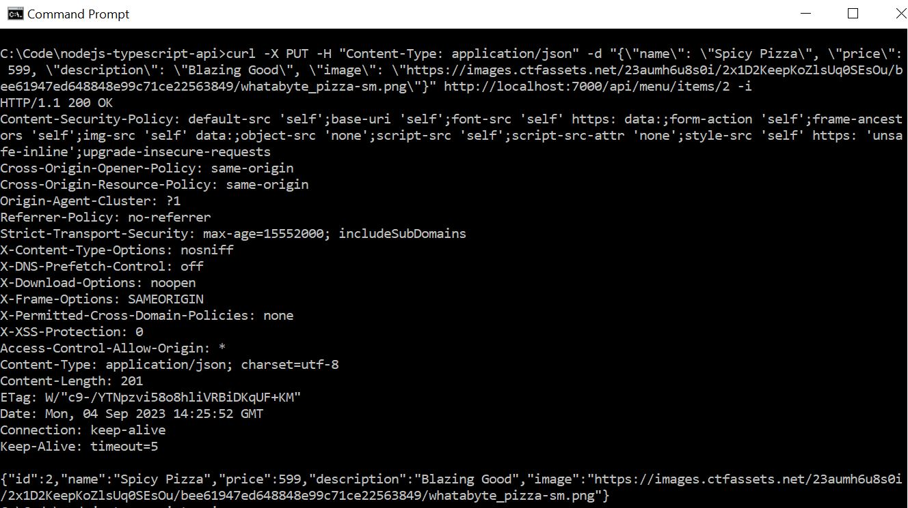
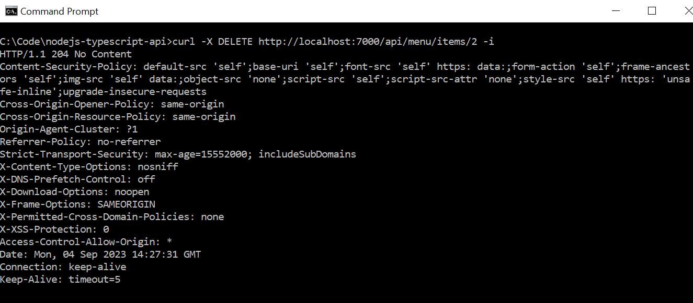

##### Get all itmes
```shell
curl http://localhost:7000/api/menu/items -i
```

The -i flag includes protocol headers in the output.

##### Get an item:
```shell
curl http://localhost:7000/api/menu/items/2 -i
```
You should get a 200 OK response with a JSON object describing a pizza.


##### Add an item:
```shell
curl -X POST -H "Content-Type: application/json" -d "{\"name\": \"Salad\", \"price\": 499, \"description\": \"Fresh\", \"image\": \"https://images.ctfassets.net/23aumh6u8s0i/5pnNAeu0kev0P5Neh9W0jj/5b62440be149d0c1a9cb84a255662205/whatabyte_salad-sm.png\" }" http://localhost:7000/api/menu/items -i
```
You should get an 201 Created response with a JSON object describing a salad.


##### Update an item:
```shell
curl -X PUT -H "Content-Type: application/json" -d "{\"name\": \"Spicy Pizza\", \"price\": 599, \"description\": \"Blazing Good\", \"image\": \"https://images.ctfassets.net/23aumh6u8s0i/2x1D2KeepKoZlsUq0SEsOu/bee61947ed648848e99c71ce22563849/whatabyte_pizza-sm.png\"}" http://localhost:7000/api/menu/items/2 -i
```
You should get a 200 OK response with a JSON object describing the updated menu item.


##### Delete an item:
```shell
curl -X DELETE http://localhost:7000/api/menu/items/2 -i
```
You should get an 204 No Content response from the server.

